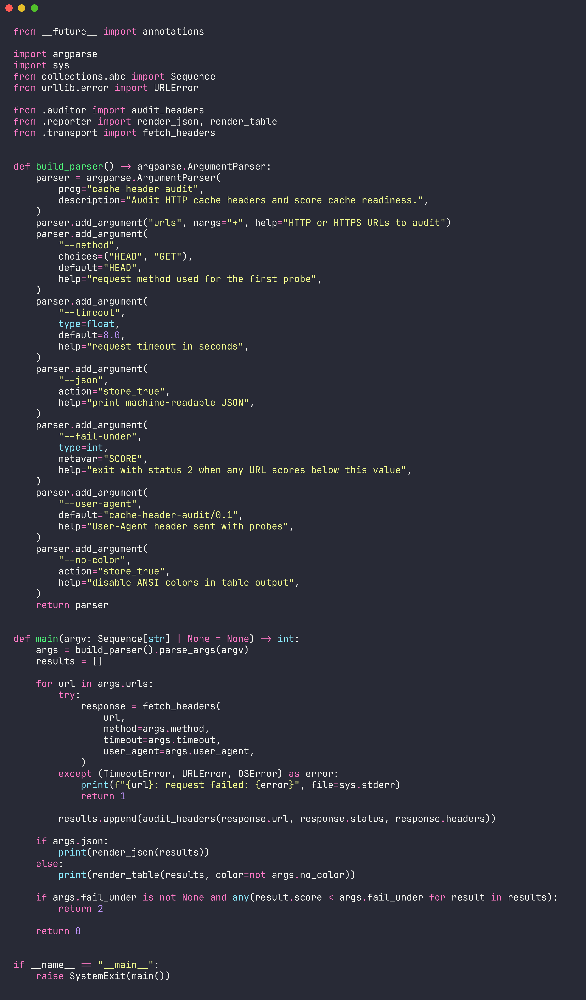
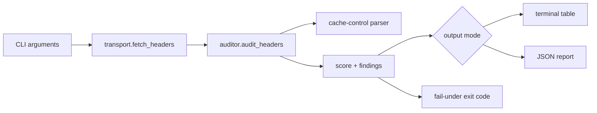

# cache-header-audit

Fast CLI for scoring HTTP cache headers across production URLs.

| Output | Use case |
| --- | --- |
| Score + grade | Quick release checks |
| Primary issue | Actionable cache fixes |
| JSON mode | CI gates and dashboards |


## Install

```bash
python3 -m pip install .
```

## Run

```bash
cache-header-audit https://example.com https://static.example.com/app.js
cache-header-audit https://example.com --json
cache-header-audit https://example.com --fail-under 75
```

## Code Snapshot



## Architecture



## CLI Reference

| Argument / flag | Default | Purpose |
| --- | ---: | --- |
| `urls` | required | One or more HTTP(S) URLs to inspect |
| `--method HEAD\|GET` | `HEAD` | First request method for probing headers |
| `--timeout SECONDS` | `8.0` | Network timeout per URL |
| `--json` | `false` | Print structured JSON |
| `--fail-under SCORE` | none | Exit with code `2` below the score |
| `--user-agent TEXT` | `cache-header-audit/0.1` | Custom probe user agent |
| `--no-color` | `false` | Disable ANSI grade colors |

## Scoring Signals

| Signal | Effect |
| --- | --- |
| `Cache-Control` present | positive |
| `max-age` / `s-maxage` | positive when useful |
| `ETag` / `Last-Modified` | positive validator coverage |
| `stale-while-revalidate` | positive resilience |
| `no-store`, `Vary: *` | strong negative |
| missing validators | warning |

## Project Layout

```text
src/cache_header_audit/
  auditor.py      scoring and findings
  cli.py          command-line interface
  parser.py       Cache-Control parsing
  reporter.py     table and JSON rendering
  transport.py    HTTP header probing
tests/
  test_auditor.py
  test_parser.py
```

## Test

```bash
PYTHONPATH=src python3 -m unittest discover -s tests
```
